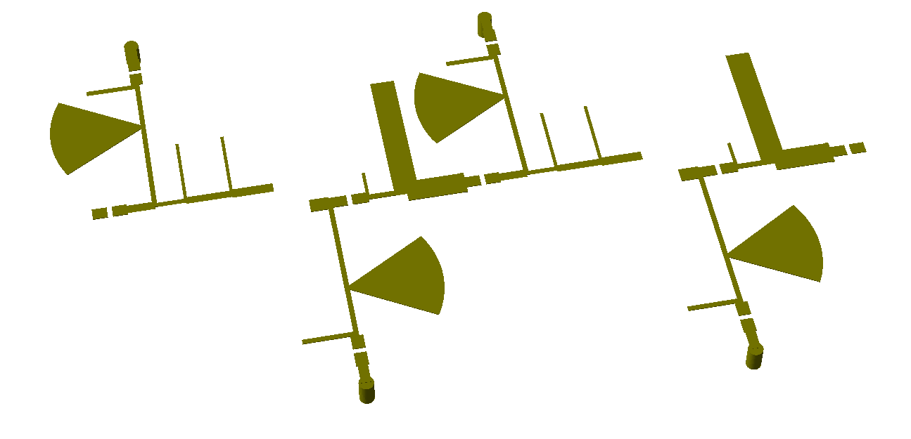

# 11GHz_LNA
This is a 11GHz microwave two-stage Low Noise Amplifier (LNA) for a Radiotelescope I'am working on as another side project. I'll be reusing a parabolic dish from an old satellite TV and making  horn antenna in the following weeks. The LNA is based arround the CE3514 (GaAs PHEMT) biased and matched using planar microstrip lines designed in AWR.

The amplifier has 1.4dB of Noise figure which is better than most commercial of the shelf LNAs on Digikey/Mouser and for a fraction of the cost. The gain is around 15dB, which maybe is not enough for the whole system (Only testing will tell), but should be enough to add a second stage and not worry too much about its noise figure due to the attenuation it will have.

Return loss is around -15dB for the same bandwidth which gives a pretty good 50 Ohm matching. The matching could be improved but the noise figure will increase, I found this configuration to be pretty reliable.

All the simulations and optimization were done in AWR, this includes S-Parameter simulation and EM Simulation. Harmonic balance and operating point simulation could not be tested because the manufacturer only provides a ".s2p" file and not a full transistor model. I used Id = 10mA / Vds = 2V as the bias point and for the non-linearities, I don't worry too much because it's operating on a very small signal.

